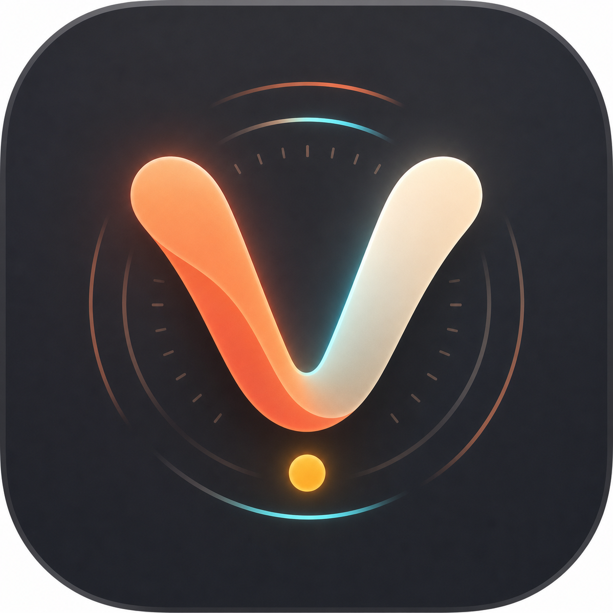
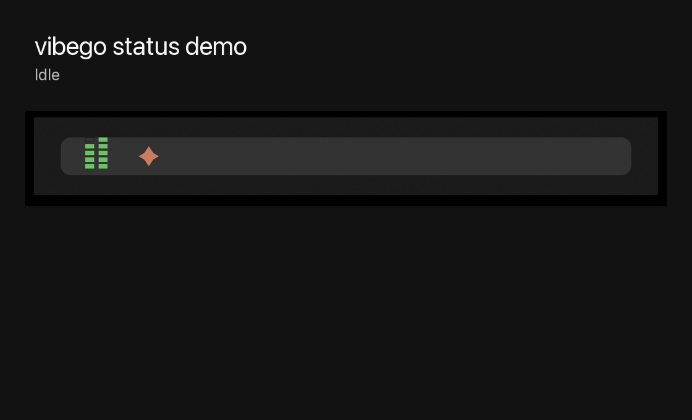
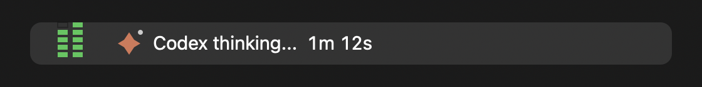
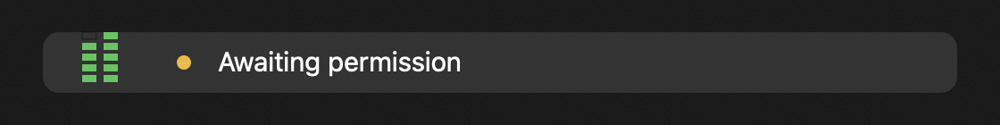
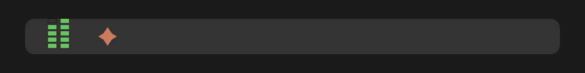
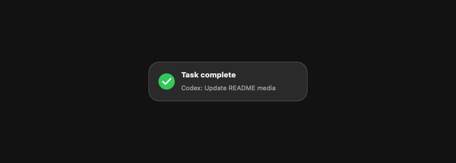

## VibeGo

[English](README.md)

<p>
  
</p>

VibeGo 是一个轻量的 macOS 菜单栏应用，用来显示 **Claude Code 和 Codex 的实时状态**：思考或运行工具时显示动画图标，需要授权时显示黄色状态，活跃任务显示计时器，任务结束时可提示完成，并能展示 Codex 限额信息。没有主窗口，没有 Dock 图标，也没有复杂仪表盘。

它适合在长任务运行时让你放心切走：只要看一眼菜单栏，就知道 Claude 或 Codex 是还在工作、正在等你授权，还是已经完成。

<a href="https://github.com/woolson/VibeGo/releases/latest/download/VibeGo.dmg"></a>
<br>

## 演示



[观看 MP4 演示视频](screenshots/demo.mp4)

---

## 预览

**状态栏**

| 空闲 | 思考中 | 运行工具 |
|---|---|---|
|  |  |  |

| 等待授权 | Claude + Codex |
|---|---|
|  |  |

**任务完成**



**完成弹窗**



## 它会显示什么

- **思考 / 工作中**：状态图标会动，并显示类似 `1m 12s` 的实时计时。
- **运行工具**：显示简短状态，例如 `Editing`、`Reading`、`Running command` 或 `Using tool`。
- **等待授权**：Claude Code 或 Codex 需要你批准时显示黄色等待状态。
- **任务完成**：回到静止的 VibeGo 图标，并可播放完成音效或显示完成弹窗。
- **Claude + Codex 同时追踪**：同时读取两个 agent 的 hook 状态文件，必要时把多个活跃会话合并到同一个菜单栏读数。
- **会话菜单**：展示最近的 Claude 和 Codex 会话，包括项目/标题与状态，会话较多时自动折叠溢出项。
- **回到正确位置**：能打开应用内对话；终端会话会记录终端 bundle id 和 TTY，点击后尽量跳回对应的 Terminal 或 iTerm 标签页。
- **Codex 限额**：显示两列 5 格竖向限额条，左列是 5 小时窗口剩余额度，右列是 7 天窗口剩余额度。点击可查看计划、上下文、重置时间和更新详情。

菜单里可以控制：

- **Show timer**：显示或隐藏 `1m 1s` 这类运行时间。
- **Play completion sound**：任务超过一分钟后完成时播放轻柔提示音。
- **Show completion popup**：任务完成时在菜单栏图标下方显示一个短暂弹窗。
- **Version and update**：显示当前版本；发现新版本时提供一键更新入口。

## 支持范围

| 场景 | 是否追踪 |
|---|---|
| Claude Code CLI（终端） | ✅ |
| Claude Code Desktop 的 **Code** 标签 | ✅ |
| Cursor 的 Claude Code 扩展 | ✅ |
| Claude Desktop 的 **Chat** 标签 | ❌ |
| **Cowork** | ❌ |
| Codex CLI / app hooks | ✅ |

## 系统要求

- macOS 12+
- [Claude Code](https://claude.com/claude-code)（CLI 或 Desktop app）
- Node.js

## 安装

### 方式 A：DMG（推荐）

已签名并公证。打开 DMG，把应用拖到 Applications，然后启动一次。

1. 从 [Releases](../../releases) 下载最新的 `VibeGo.dmg`。
2. 打开 DMG，把 **VibeGo** 拖到 Applications。
3. 启动一次。首次启动时会自动写入 Claude Code 和 Codex hooks。
4. 开始新的 Claude Code 或 Codex 会话，agent 活跃时菜单栏图标会自动更新。

### 更新

下载最新 DMG，把应用拖到 Applications 并选择 **Replace**。  
启动一次后，VibeGo 会在版本变化时刷新 hooks；之后重启 Claude Code 让新 hooks 生效。

### 方式 B：Claude Code 插件

在 Claude Code 内自动安装 hooks（状态和生命周期）：

```text
/plugin marketplace add woolson/VibeGo
/plugin install vibego@VibeGo
```

插件只安装 hooks，不会安装 macOS 应用本体，所以仍然需要先从 DMG 把 **VibeGo** 拖到 Applications。安装后，插件会在会话开始时自动启动应用，除非你明确退出过 VibeGo。

## 工作原理

应用本身是无状态的。Claude Code hooks 会把当前状态写入 `~/.claude/statusbar/state.json`，Codex hooks 会写入 `~/.codex/statusbar/state.json`。每个 agent 的 `sessions.d` 目录还保存按会话拆分的状态文件，所以菜单可以显示多个最近会话，而菜单栏本身保持简洁。应用每 0.4 秒轮询这些文件，并渲染当前活跃 agent，或合并显示 Claude + Codex 的状态。

Codex 限额数据来自 `~/.codex/sessions/` 下最新的 `token_count` 事件，使用 300 分钟主窗口和 10080 分钟次窗口。CLI hooks 还会记录终端元数据，包括应用 bundle id 和 TTY，因此点击 CLI 会话时，能尽量跳回匹配的 Terminal 或 iTerm 标签页。

安装器会合并 hooks 到 `~/.claude/settings.json`（会先备份）。应用唯一的网络请求是每天一次检查 GitHub 最新 release，用于显示更新提示（见 [隐私说明](docs/privacy.md)）。

## 致谢

VibeGo 基于原项目 [claude-statusbar](https://github.com/m1ckc3s/claude-status-bar) 的思路和基础继续扩展。感谢原作者把这个小巧实用的菜单栏状态工具开源出来，让它可以被继续打磨和改造。

## 卸载

```bash
node "/Applications/VibeGo.app/Contents/Resources/uninstall.js"   # 只移除 VibeGo 写入的 hooks
```

然后把应用拖到废纸篓即可。

## 商标 / 非官方项目

这是一个非官方的开源个人项目。**它不隶属于 Anthropic，也不受 Anthropic 认可、赞助或背书。** “Claude” 和 Claude spark logo 是 Anthropic 的商标，此处仅作指称性使用。本项目使用 MIT 许可证，但该许可证只覆盖源码，不授予任何 Anthropic 商标或品牌相关权利。

如果我侵犯或影响了你的商标权益，请通过 X Chat 联系我（[@mickces](https://x.com/mickces)）。这是一个免费个人项目，我没有通过它获利。

## 许可证

MIT
